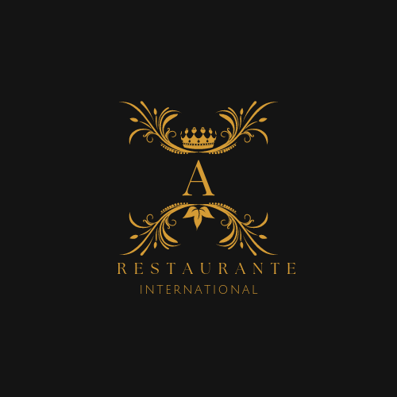
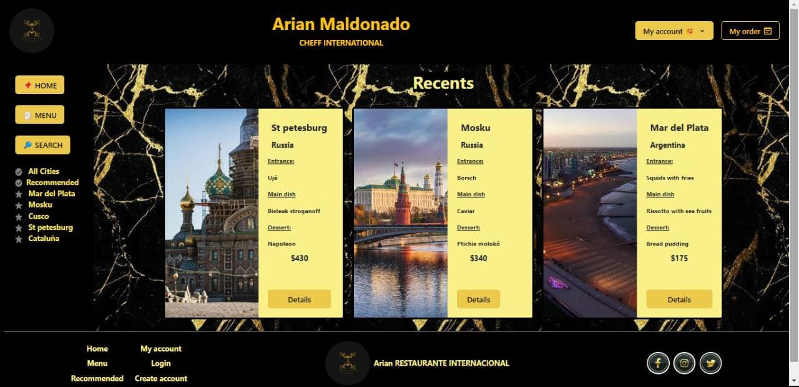
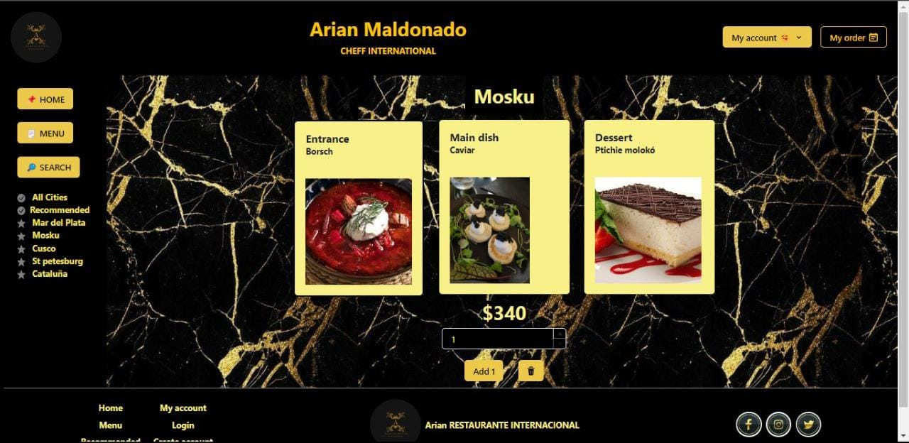
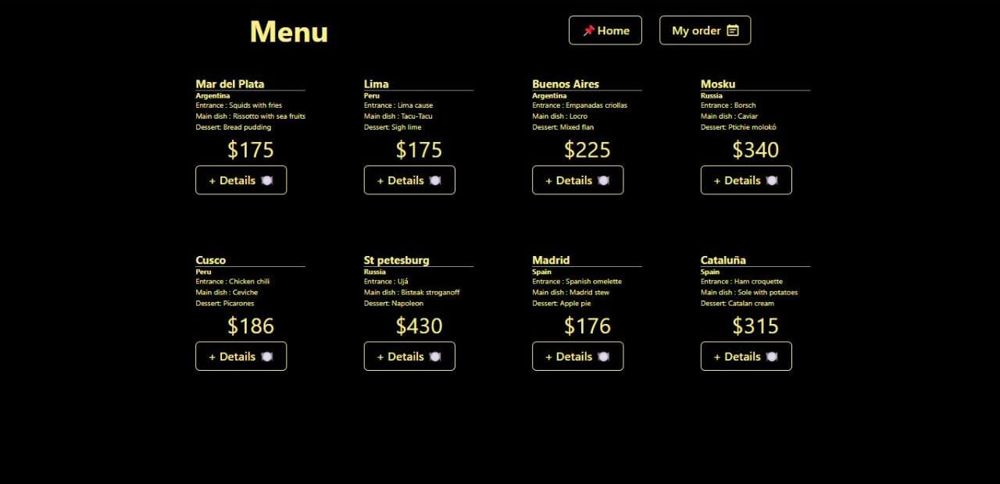
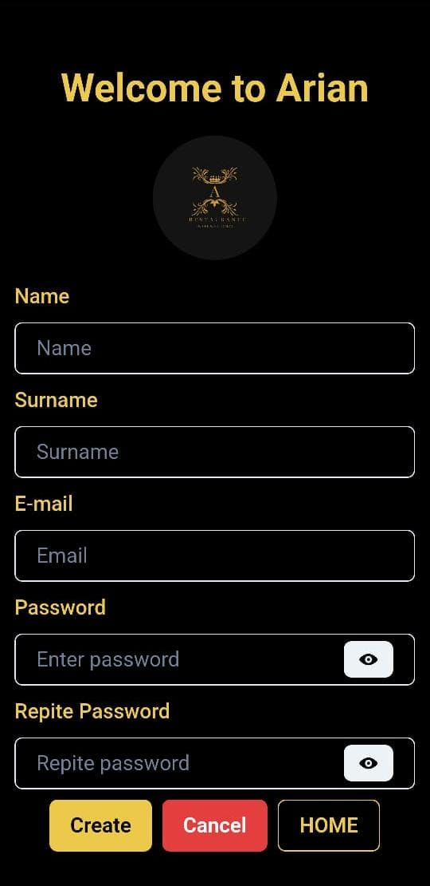
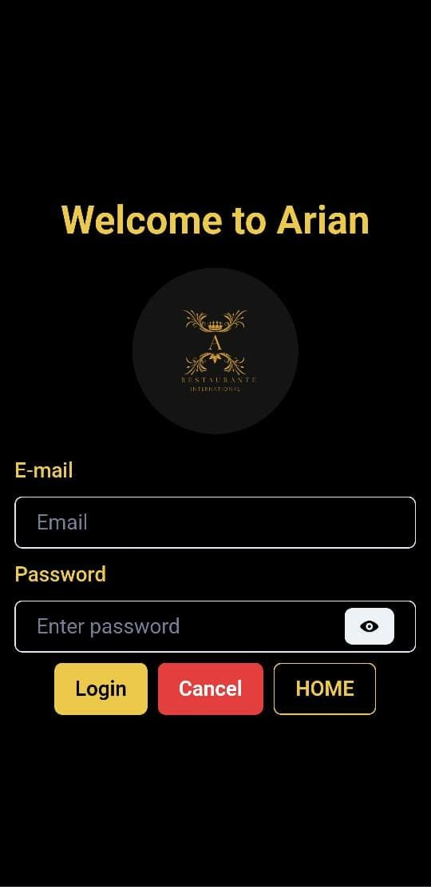
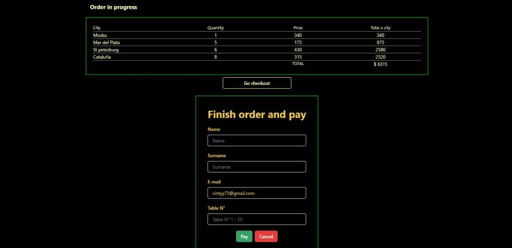

# E-commerce 📝 Arian Rest 🍽️

## Proyecto final FrontEnd ADA ITW

### Intro

---

- `Proyecto final` de la carrera de `Desarrolo Frontend` `ADA ITW`

  Es un diseño totalmente responsive para ser utilizado desde cualquier dispositivo.

  Tecnologías empleadas:

- [Vite](https://vitejs.dev/guide/)
- [React JS](https://es.react.dev/learn)
- [React Hook Form](https://react-hook-form.com/)
- [React Router Dom](https://reactrouter.com/en/main)
- [Chakra UI](https://chakra-ui.com/docs/)
- [Firebase](https://firebase.google.com/docs?hl=es-419)
- [Vercel](https://vercel.com/)

### Descripción

---

- E-commerce de un Restaurant donde podrás:

  - `Registrarte`
  - `Iniciar sesión`
  - `Menú` basado en una lista de `ciudades` con comidas Típicas de cada regíon
  - \*Cada una con `Entrada`, `Plato principal` y `Postre` por un valor que incluye todo
  - Tendrás una `vista` de `ciudades`:
  - `*Recomendadas`
  - `*Cada una de las Recomendadas`
  - `*Recientes`
  - `Filtrar` por:
    - `País` y elegir rango `precio mínimo/máximo`
  - Vista de cada `ciudad` detallando con foto:
    - `Entrada`
    - `Plato principal`
    - `Postre`
    - `Precio`
    - `Elegir/Editar cantidad`
    - `Añadir/Eliminar` a la `orden`
  - Visualizar un `menú` con el `detalle` de todas las ciudades, su contenido y precio
  - `Iniciando sesión` acederás a:
    - `Datos de usuario`
    - `Ordenes anteriores`
    - Concluir la orden y Pagar

---

## Para poder utlizar la App debes seguir los pasos detallados a continuación:

1. Clonar este repositorio.
2. Instalar las dependencias del proyecto mediante el comando npm install.
3. Ejecutar el proyecto mediante el comando npm run dev.
4. Si desea compartir en la red local mediante un servidor utilice el comando npm run dev -- --host y comparta el link.

- \*Los dispositivos deben estar conectados en la misma red Wifi.

##### Para hacer uso necesitarás configurar Firebase:

1. Instalar Firebase en tu local.
2. Crear tu proyecto en firebase.
3. Copiar el archivo .env.example en tu local
4. Agregar valor de tus keys a las variables.

##### Te dejo algunas Screenshots de mi App.

### Logo de App

.

### Home

.

### Detalle de ciudades

.

### Filtros

.

### Menú

.

### Login

.

### Register

.

### Checkout

.

### Ordenes anteriores

.

### Ahora te invito a probar mi App.

Te dejo el link!

- 👉https://todo-list-react-cintyy73.vercel.app
